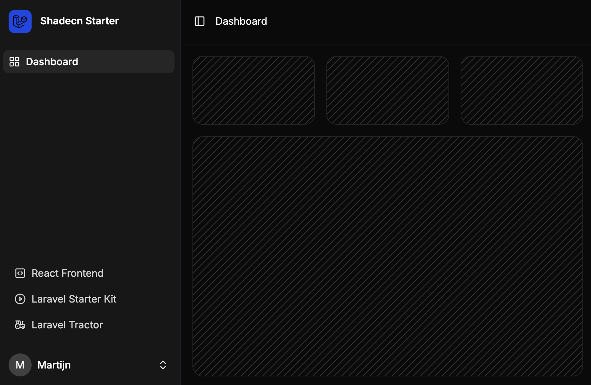

# Laravel React Starter Kit (Fortify & Sanctum)

A Laravel starter kit with a standalone React + [ShadCN UI](https://ui.shadcn.com) frontend.

This kit uses a similar frontend as the new Laravel React Kit, but **without Inertia**. It’s designed for projects where the frontend and backend are fully decoupled.

The frontend can also be used standalone.

See the React frontend repository:

https://github.com/bjornleonhenry/laravel-react-frontend




---

## ⚡️ Why use this kit?

Laravel Sanctum and Fortify make authentication with a separate frontend possible - but not always simple. You need to configure CORS, session domains, and cross-origin cookies correctly.

This starter kit handles that setup for you. It works out of the box, so you can focus on building your app - not fixing config issues.

---

## 🔧 Installation

```sh
laravel new --using=oso/laravel-react-starter project
cd project
php artisan migrate
composer run dev
```

> The React frontend will be installed in the ~/frontend directory.

This separation is intentional to highlight the decoupled architecture. You can build and deploy the frontend and backend independently - for example, deploy the frontend as a static site to S3 and the backend as an API.

> You can change the installation directory of the frontend in the FrontendInstall command.

---

## 🔌 Why not Inertia?
Inertia.js is a great tool for backend developers who want to build dynamic frontends using React or Vue, without fully adopting a traditional SPA architecture. It removes the need to duplicate routes between the frontend and backend and provides server-side rendering out of the box.

However, Inertia tightly couples the frontend to the Laravel backend. In some cases, this is not desirable—especially when:

- You work in larger teams with dedicated frontend developers who don't want to—or can't—work within a Laravel backend environment.
- The frontend is developed, deployed, and hosted independently from the backend.
- You prefer the flexibility and separation of concerns offered by a fully decoupled architecture.

In these scenarios, Inertia is not the right fit.

Ultimately, it comes down to preference and project structure. Personally, I’ve grown to prefer frontends that communicate with the backend exclusively through REST/JSON APIs. This approach gives more flexibility and clearer boundaries between frontend and backend responsibilities.

If that sounds like your workflow too, this starter kit is made for you.

---

## 🔍 Inertia vs. Decoupled SPA: Key Differences

| Feature / Concern               | **Inertia.js**                                    | **Decoupled SPA** (this Starter Kit)                  |
| ------------------------------- | ------------------------------------------------- | ----------------------------------------------------- |
| **Architecture**                | Tightly coupled                                   | Fully separated frontend & backend                    |
| **Routing**                     | Laravel handles routing                           | React handles routing                                 |
| **Deployment**                  | Frontend bundled with Laravel                     | Frontend and backend deployed independently           |
| **Best for**                    | Full-stack Laravel teams                          | Teams with separate backend/frontend responsibilities |
| **API Communication**           | Implicit via Laravel controllers                  | Explicit REST/JSON APIs                               |
| **Frontend Hosting**            | Served via Laravel                                | Can be hosted on S3, Vercel, Netlify, etc.            |
| **Frontend Flexibility**        | Bound to Laravel blade/inertia lifecycle          | 100% JavaScript stack freedom                         |
| **SSR (Server-Side Rendering)** | Included                                          | Optional (e.g., via Next.js if needed)                |
| **Learning Curve**              | Lower for Laravel devs, no API boilerplate needed | Requires clear API design and frontend skills         |

---

## ✅ Features
- ✅ Fully decoupled React + ShadCN UI frontend
- ✅ Laravel Fortify + Sanctum authentication
- ✅ Pure REST/JSON-based communication
- ✅ No Inertia or Blade required
- ✅ Suitable for multi-domain deployments

## ⚙️ Preconfigured .env Settings

The following settings are preconfigured to support cross-origin auth:

```dotenv
APP_URL=http://localhost:8000
APP_FRONTEND_URL=http://localhost:5173
SANCTUM_STATEFUL_DOMAINS=localhost
SESSION_SAME_SITE=lax
SESSION_DOMAIN=localhost
```
