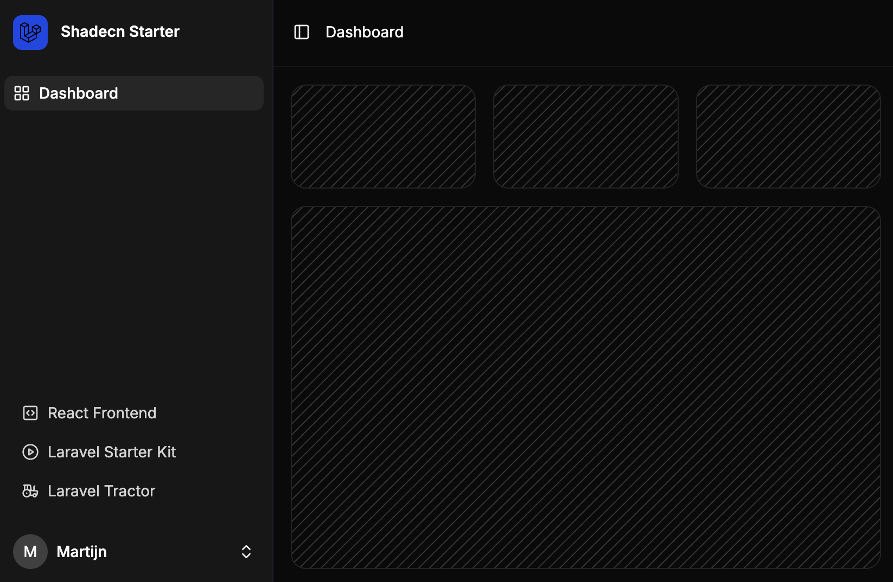

# Laravel React standalone frontend.

This repository contains a standalone React / Shadecn frontend for Laravel.
It works without Inertia and is decoupled from its backend.



## Required endpoints.

By default the following backend base url is set:

```dotenv
VITE_API_BASE_URL=http://localhost:8000/api
```

This frontend application expects the following endpoints:

```javascript

// ~/config/end-points.ts

export const END_POINTS = {
    AUTH_CSRF: 'csrf-cookie',
    
    AUTH_LOGIN: 'login',
    AUTH_LOGOUT : 'logout',
    AUTH_REGISTER: 'register',
    AUTH_FORGOT_PASSWORD: 'forgot-password',
    AUTH_RESET_PASSWORD: 'reset-password',
    AUTH_GET_USER: 'user',

    SETTINGS_UPDATE_PROFILE_INFORMATION: 'user/profile-information',
    SETTINGS_UPDATE_PASSWORD: 'user/password',
    SETTINGS_DELETE_USER: 'user',
}
```

These endpoints will be installed by default with the Laravel React Starter Kit.

https://github.com/oso/laravel-react-starter

## Installation with Laravel

To use this frontend with a fresh Laravel application use the `laravel new` command:

```shell
laravel new --using=oso/laravel-react-starter my-project
```

This will install and configure Laravel Fortify and Laravel Sanctum